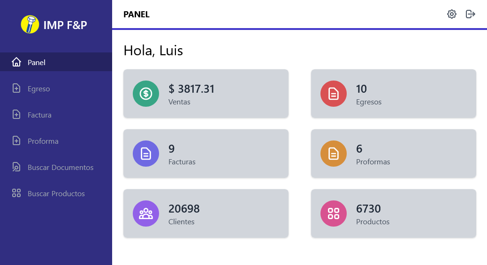
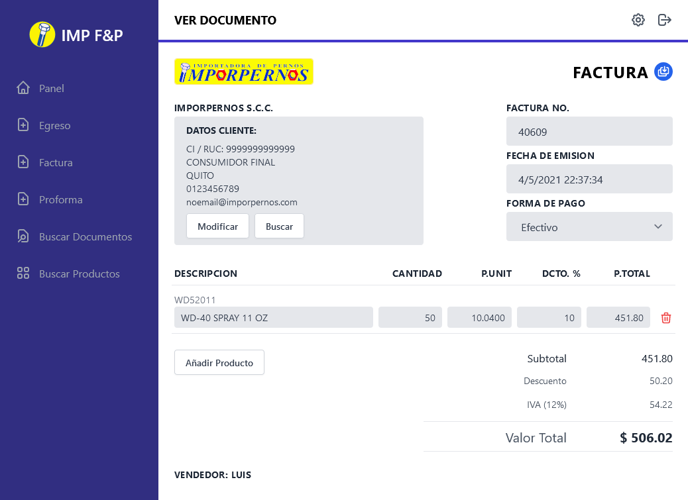
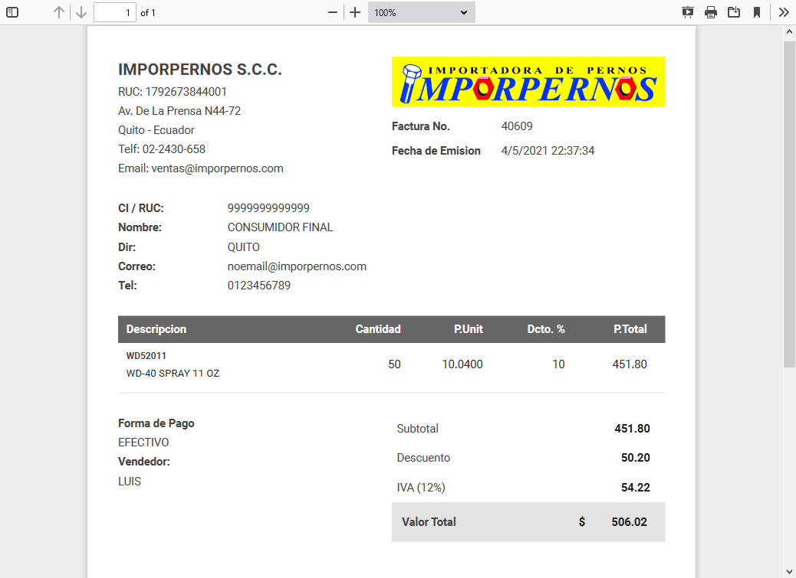
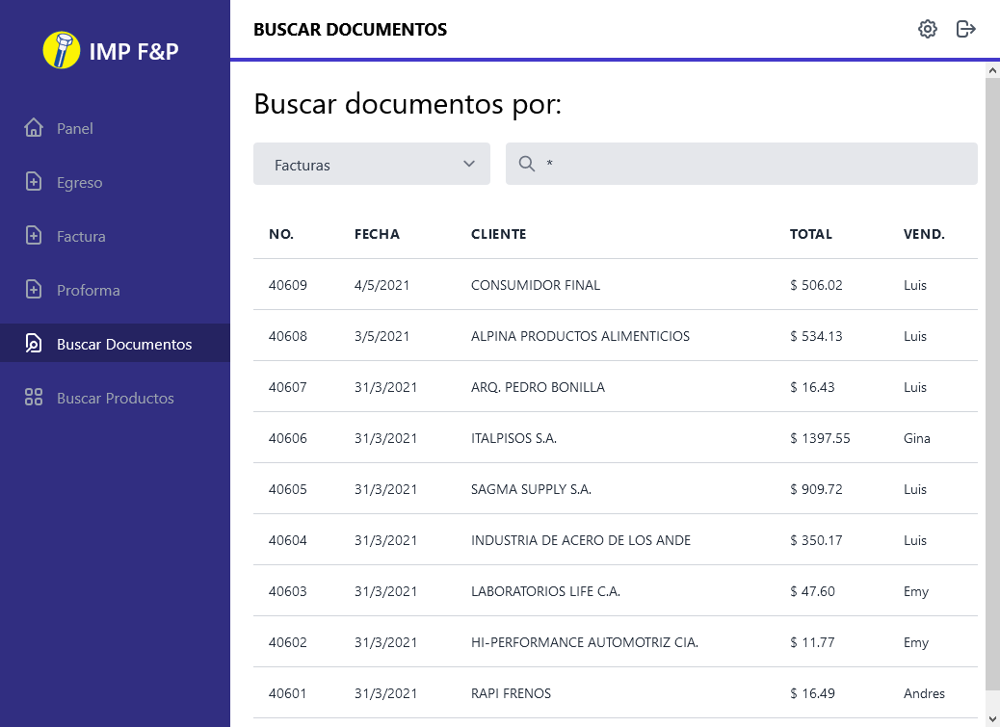
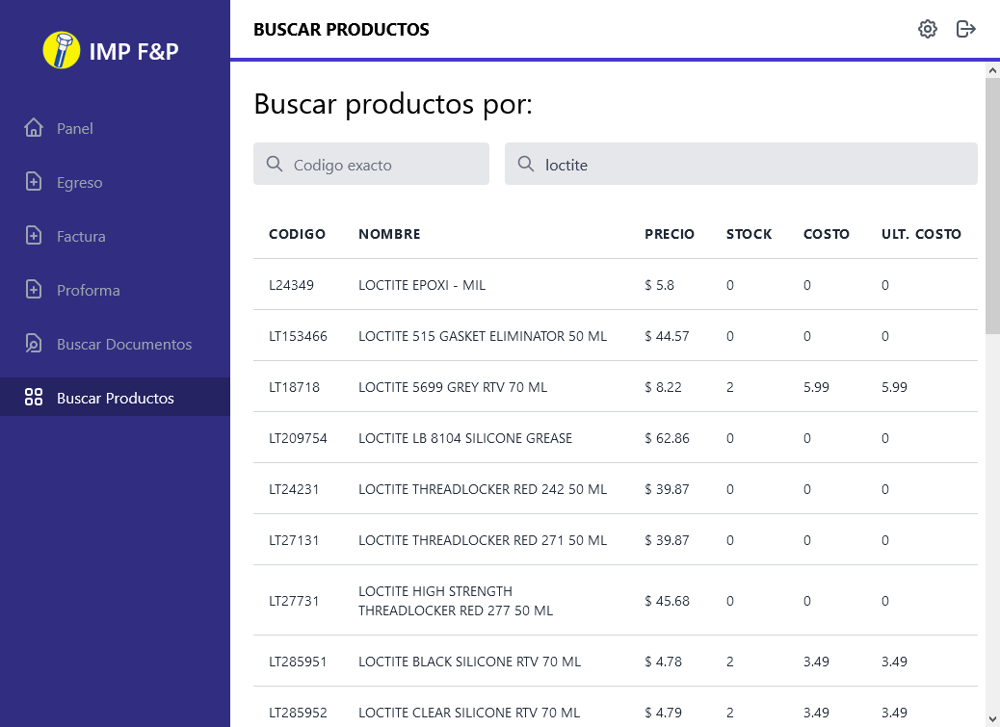
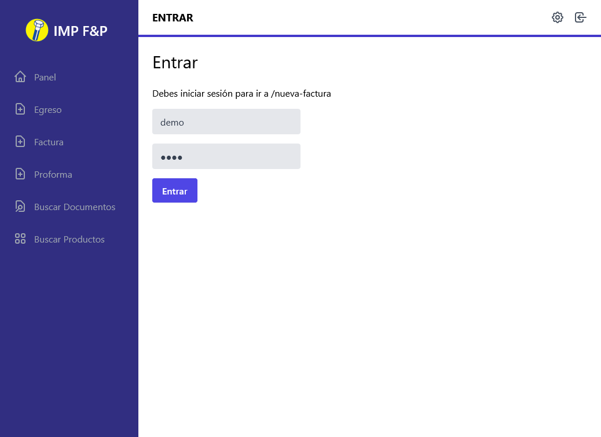

<h1 align="center">IMP Invoicing App</h1>

IMP Invoicing is an in-house full-stack web application built with Node.js / Express (Back-end REST JSON API) and React / Tailwind CSS (Front-end). It generates PDF invoices and quotes with client and product data served from the back-end.

    

> It's primarily used by our salesmen to register new invoices or quotes and in-store as a backup invoicing system while the main system is being maintained.

## Back-end main features

- REST JSON API built with Node.js and Express
- CRUD application with local JSON Data
- Uses `compression` and `cors` middlewares
- Serves the front-end build
- Generates and handles session tokens
- Encrypted passwords with `node crypto`
- Background worker, keeps stats up to date
- Background worker, cleans expired tokens

## Front-end main features
- Built with `create-react-app`
- Uses `axios`, `react-router-dom` with `private routes` and `custom hooks`
- User login with persistent sessions 
- Responsive design using `Taiwind CSS`
- Dynamic Stats Dashboard
- `Create` and `Edit` Invoices / Quotes
- Add existing client or register new one
- Unlimited product lines per document
- Per product line `editable fields` (name, price, discount %)
- `Save` and Print document in `PDF` with `react-pdf`
- Prevents from navigating away on unsaved documents
- Search documents by type or number
- Search products by code or name

## More screenshots

    
    
    
    
    

## Live Demo

Try the live demo at https://imp-invoicing-react.web.app/ with the credentials below. Just beware that the interface is in the Spanish language.

User: **`demo`**
Password: **`demo`**

> **Note**: this demo does not contain real data.

To add a client by ID try `9999999999` or by name try `john` or `doe`

To add a product by ID try `demo1`, `demo2` or `demo3` or by name try `product`

Have fun experimenting!